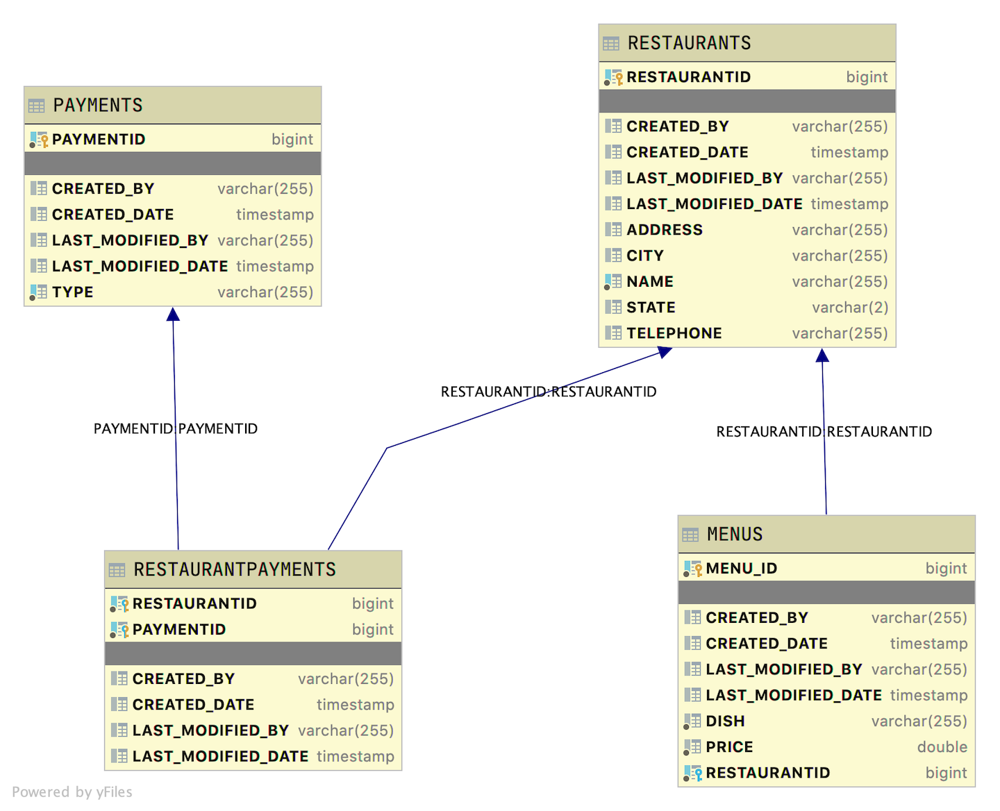

# Java Restaurants That Serve More than Coffee

A student that completes this project shows they can:

* explain what automated testing is and why it is important
* use JUnit to write, run, and interpret the output of unit tests for services with or without database access
* use JUnit to write, run, and interpret the output of unit tests for controllers
* implement Automated Integration Testing for REST APIs using JUnit and RestAssured

## Introduction

This is a basic database scheme with restaurants, menus, payment system. This Java Spring REST API application will provide endpoints for clients to read various data sets contained in the application's data.

### Database layout

The table layouts are as follows

* Restaurant is the driving table.
* Menus have a Many-To-One relationship with Restaurant. Each Restaurant has many menus. Each menu has only one Restaurant.
* Payments have a Many-To-Many relationship with Restaurants.



Using the provided seed data, the given endpoint will produce the stated output. Expand each endpoint to see its correct output.

<details>
<summary>POST http://localhost:2019/restaurants/restaurant</summary>

DATA

```JSON
{
    "name": "Good Eats",
    "address": "123 Main Avenue",
    "city": "Uptown",
    "state": "ST",
    "telephone": "555-777-7777",
    "menus": [
        {
            "dish": "Soda",
            "price": 3.50
        },
        {
            "dish": "Latte",
            "price": 5.00
        }
    ],
    "payments": [
        {
            "payment" : {
                "paymentid":2
            }
        },
        {
            "payment" : {
                "paymentid":3
            }
        }
    ]
}
```

OUTPUT

```TEXT
Status 201 Created

Location Header: http://localhost:2019/restaurants/restaurant/15
```

</details>

<details>
<summary>PUT http://localhost:2019/restaurants/restaurant/10</summary>

DATA

```JSON
{
    "name": "Stumps Eatery",
    "address": "123 Main Avenue",
    "city": "Uptown",
    "state": "ST",
    "telephone": "555-777-7777",
    "menus": [
        {
            "dish": "Soda",
            "price": 3.50
        },
        {
            "dish": "Latte",
            "price": 5.00
        }
    ],
    "payments": [
        {
            "payment" : {
                "paymentid":2
            }
        },
        {
            "payment" : {
                "paymentid":3
            }
        }
    ]
}```

OUTPUT

```TEXT
Status OK
```

</details>

<details>
<summary>DELETE http://localhost:2019/restaurants/restaurant/15</summary>

```JSON
Status OK
```

</details>

<details>
<summary>http://localhost:2019/restaurants/restaurant/15</summary>

```JSON
{
    "timestamp": "2020-06-17T03:20:54.532+0000",
    "status": 500,
    "error": "Internal Server Error",
    "message": "Restaurant id 15 not found!",
    "trace": "javax.persistence.EntityNotFoundException: Restaurant id 15 not found!\n\tat com.lambdaschool.restaurants.services.RestaurantServiceImpl.lambda$findRestaurantById$0(RestaurantServiceImpl.java:74)\n\tat java.base/java.util.Optional.orElseThrow(Optional.java:401)\n\tat com.lambdaschool.restaurants.services.RestaurantServiceImpl.findRestaurantById(RestaurantServiceImpl.java:74)\n\tat com.lambdaschool.restaurants.services.RestaurantServiceImpl$$FastClassBySpringCGLIB$$6b6299c6.invoke(<generated>)\n\tat org.springframework.cglib.proxy.MethodProxy.invoke(MethodProxy.java:218)\n\tat org.springframework.aop.framework.CglibAopProxy$CglibMethodInvocation.invokeJoinpoint(CglibAopProxy.java:771)\n\tat org.springframework.aop.framework.ReflectiveMethodInvocation.proceed(ReflectiveMethodInvocation.java:163)\n\tat org.springframework.aop.framework.CglibAopProxy$CglibMethodInvocation.proceed(CglibAopProxy.java:749)\n\tat org.springframework.transaction.interceptor.TransactionAspectSupport.invokeWithinTransaction(TransactionAspectSupport.java:366)\n\tat org.springframework.transaction.interceptor.TransactionInterceptor.invoke(TransactionInterceptor.java:118)\n\tat org.springframework.aop.framework.ReflectiveMethodInvocation.proceed(ReflectiveMethodInvocation.java:186)\n\tat org.springframework.aop.framework.CglibAopProxy$CglibMethodInvocation.proceed(CglibAopProxy.java:749)\n\tat org.springframework.aop.framework.CglibAopProxy$DynamicAdvisedInterceptor.intercept(CglibAopProxy.java:691)\n\tat com.lambdaschool.restaurants.services.RestaurantServiceImpl$$EnhancerBySpringCGLIB$$8699aede.findRestaurantById(<generated>)\n\tat com.lambdaschool.restaurants.controllers.RestaurantController.getRestaurantById(RestaurantController.java:63)\n\tat java.base/jdk.internal.reflect.NativeMethodAccessorImpl.invoke0(Native Method)\n\tat java.base/jdk.internal.reflect.NativeMethodAccessorImpl.invoke(NativeMethodAccessorImpl.java:62)\n\tat java.base/jdk.internal.reflect.DelegatingMethodAccessorImpl.invoke(DelegatingMethodAccessorImpl.java:43)\n\tat java.base/java.lang.reflect.Method.invoke(Method.java:564)\n\tat org.springframework.web.method.support.InvocableHandlerMethod.doInvoke(InvocableHandlerMethod.java:190)\n\tat org.springframework.web.method.support.InvocableHandlerMethod.invokeForRequest(InvocableHandlerMethod.java:138)\n\tat org.springframework.web.servlet.mvc.method.annotation.ServletInvocableHandlerMethod.invokeAndHandle(ServletInvocableHandlerMethod.java:105)\n\tat org.springframework.web.servlet.mvc.method.annotation.RequestMappingHandlerAdapter.invokeHandlerMethod(RequestMappingHandlerAdapter.java:879)\n\tat org.springframework.web.servlet.mvc.method.annotation.RequestMappingHandlerAdapter.handleInternal(RequestMappingHandlerAdapter.java:793)\n\tat org.springframework.web.servlet.mvc.method.AbstractHandlerMethodAdapter.handle(AbstractHandlerMethodAdapter.java:87)\n\tat org.springframework.web.servlet.DispatcherServlet.doDispatch(DispatcherServlet.java:1040)\n\tat org.springframework.web.servlet.DispatcherServlet.doService(DispatcherServlet.java:943)\n\tat org.springframework.web.servlet.FrameworkServlet.processRequest(FrameworkServlet.java:1006)\n\tat org.springframework.web.servlet.FrameworkServlet.doGet(FrameworkServlet.java:898)\n\tat javax.servlet.http.HttpServlet.service(HttpServlet.java:634)\n\tat org.springframework.web.servlet.FrameworkServlet.service(FrameworkServlet.java:883)\n\tat javax.servlet.http.HttpServlet.service(HttpServlet.java:741)\n\tat org.apache.catalina.core.ApplicationFilterChain.internalDoFilter(ApplicationFilterChain.java:231)\n\tat org.apache.catalina.core.ApplicationFilterChain.doFilter(ApplicationFilterChain.java:166)\n\tat org.apache.tomcat.websocket.server.WsFilter.doFilter(WsFilter.java:53)\n\tat org.apache.catalina.core.ApplicationFilterChain.internalDoFilter(ApplicationFilterChain.java:193)\n\tat org.apache.catalina.core.ApplicationFilterChain.doFilter(ApplicationFilterChain.java:166)\n\tat org.springframework.web.filter.RequestContextFilter.doFilterInternal(RequestContextFilter.java:100)\n\tat org.springframework.web.filter.OncePerRequestFilter.doFilter(OncePerRequestFilter.java:119)\n\tat org.apache.catalina.core.ApplicationFilterChain.internalDoFilter(ApplicationFilterChain.java:193)\n\tat org.apache.catalina.core.ApplicationFilterChain.doFilter(ApplicationFilterChain.java:166)\n\tat org.springframework.web.filter.FormContentFilter.doFilterInternal(FormContentFilter.java:93)\n\tat org.springframework.web.filter.OncePerRequestFilter.doFilter(OncePerRequestFilter.java:119)\n\tat org.apache.catalina.core.ApplicationFilterChain.internalDoFilter(ApplicationFilterChain.java:193)\n\tat org.apache.catalina.core.ApplicationFilterChain.doFilter(ApplicationFilterChain.java:166)\n\tat org.springframework.web.filter.CharacterEncodingFilter.doFilterInternal(CharacterEncodingFilter.java:201)\n\tat org.springframework.web.filter.OncePerRequestFilter.doFilter(OncePerRequestFilter.java:119)\n\tat org.apache.catalina.core.ApplicationFilterChain.internalDoFilter(ApplicationFilterChain.java:193)\n\tat org.apache.catalina.core.ApplicationFilterChain.doFilter(ApplicationFilterChain.java:166)\n\tat org.apache.catalina.core.StandardWrapperValve.invoke(StandardWrapperValve.java:202)\n\tat org.apache.catalina.core.StandardContextValve.invoke(StandardContextValve.java:96)\n\tat org.apache.catalina.authenticator.AuthenticatorBase.invoke(AuthenticatorBase.java:541)\n\tat org.apache.catalina.core.StandardHostValve.invoke(StandardHostValve.java:139)\n\tat org.apache.catalina.valves.ErrorReportValve.invoke(ErrorReportValve.java:92)\n\tat org.apache.catalina.core.StandardEngineValve.invoke(StandardEngineValve.java:74)\n\tat org.apache.catalina.connector.CoyoteAdapter.service(CoyoteAdapter.java:343)\n\tat org.apache.coyote.http11.Http11Processor.service(Http11Processor.java:373)\n\tat org.apache.coyote.AbstractProcessorLight.process(AbstractProcessorLight.java:65)\n\tat org.apache.coyote.AbstractProtocol$ConnectionHandler.process(AbstractProtocol.java:868)\n\tat org.apache.tomcat.util.net.NioEndpoint$SocketProcessor.doRun(NioEndpoint.java:1590)\n\tat org.apache.tomcat.util.net.SocketProcessorBase.run(SocketProcessorBase.java:49)\n\tat java.base/java.util.concurrent.ThreadPoolExecutor.runWorker(ThreadPoolExecutor.java:1130)\n\tat java.base/java.util.concurrent.ThreadPoolExecutor$Worker.run(ThreadPoolExecutor.java:630)\n\tat org.apache.tomcat.util.threads.TaskThread$WrappingRunnable.run(TaskThread.java:61)\n\tat java.base/java.lang.Thread.run(Thread.java:832)\n",
    "path": "/restaurants/restaurant/15"
}
```

</details>

<summary>http://localhost:2019/restaurants/restaurant/10</summary>

```JSON
{
    "restaurantid": 10,
    "name": "Stumps Eatery",
    "address": "123 Main Avenue",
    "city": "Uptown",
    "state": "ST",
    "telephone": "555-777-7777",
    "payments": [
        {
            "payment": {
                "paymentid": 2,
                "type": "Cash"
            }
        },
        {
            "payment": {
                "paymentid": 3,
                "type": "Mobile Pay"
            }
        }
    ],
    "menus": [
        {
            "menuId": 18,
            "dish": "Soda",
            "price": 3.5
        },
        {
            "menuId": 19,
            "dish": "Latte",
            "price": 5.0
        }
    ]
}
```

</details>

<details>
<summary>http://localhost:2019/restaurants/restaurant/name/Stumps%20Eatery</summary>

```JSON
{
    "restaurantid": 10,
    "name": "Stumps Eatery",
    "address": "123 Main Avenue",
    "city": "Uptown",
    "state": "ST",
    "telephone": "555-777-7777",
    "payments": [
        {
            "payment": {
                "paymentid": 2,
                "type": "Cash"
            }
        },
        {
            "payment": {
                "paymentid": 3,
                "type": "Mobile Pay"
            }
        }
    ],
    "menus": [
        {
            "menuId": 18,
            "dish": "Soda",
            "price": 3.5
        },
        {
            "menuId": 19,
            "dish": "Latte",
            "price": 5.0
        }
    ]
}
```

</details>

<details>
<summary>http://localhost:2019/restaurants/restaurants</summary>

```JSON
[
    {
        "restaurantid": 4,
        "name": "Apple",
        "address": "123 Main Street",
        "city": "City",
        "state": "ST",
        "telephone": "555-555-1234",
        "payments": [
            {
                "payment": {
                    "paymentid": 1,
                    "type": "Credit Card"
                }
            },
            {
                "payment": {
                    "paymentid": 2,
                    "type": "Cash"
                }
            },
            {
                "payment": {
                    "paymentid": 3,
                    "type": "Mobile Pay"
                }
            }
        ],
        "menus": [
            {
                "menuId": 5,
                "dish": "Mac and Cheese",
                "price": 6.95
            },
            {
                "menuId": 6,
                "dish": "Lasagna",
                "price": 8.5
            },
            {
                "menuId": 7,
                "dish": "Meatloaf",
                "price": 7.77
            },
            {
                "menuId": 8,
                "dish": "Tacos",
                "price": 8.49
            },
            {
                "menuId": 9,
                "dish": "Chef Salad",
                "price": 12.5
            }
        ]
    },
    {
        "restaurantid": 10,
        "name": "Stumps Eatery",
        "address": "123 Main Avenue",
        "city": "Uptown",
        "state": "ST",
        "telephone": "555-777-7777",
        "payments": [
            {
                "payment": {
                    "paymentid": 2,
                    "type": "Cash"
                }
            },
            {
                "payment": {
                    "paymentid": 3,
                    "type": "Mobile Pay"
                }
            }
        ],
        "menus": [
            {
                "menuId": 18,
                "dish": "Soda",
                "price": 3.5
            },
            {
                "menuId": 19,
                "dish": "Latte",
                "price": 5.0
            }
        ]
    },
    {
        "restaurantid": 13,
        "name": "Number 1 Eats",
        "address": "565 Side Avenue",
        "city": "Village",
        "state": "ST",
        "telephone": "555-123-1555",
        "payments": [
            {
                "payment": {
                    "paymentid": 1,
                    "type": "Credit Card"
                }
            },
            {
                "payment": {
                    "paymentid": 3,
                    "type": "Mobile Pay"
                }
            }
        ],
        "menus": [
            {
                "menuId": 14,
                "dish": "Pizza",
                "price": 15.15
            }
        ]
    }
]
```

</details>

<details>
<summary>http://localhost:2019/restaurants/restaurants/name/Eats/city/Vill</summary>

```JSON
[
    {
        "restaurantid": 13,
        "name": "Number 1 Eats",
        "address": "565 Side Avenue",
        "city": "Village",
        "state": "ST",
        "telephone": "555-123-1555",
        "payments": [
            {
                "payment": {
                    "paymentid": 1,
                    "type": "Credit Card"
                }
            },
            {
                "payment": {
                    "paymentid": 3,
                    "type": "Mobile Pay"
                }
            }
        ],
        "menus": [
            {
                "menuId": 14,
                "dish": "Pizza",
                "price": 15.15
            }
        ]
    }
]
```

</details>

<details>
<summary>http://localhost:2019/restaurants/restaurants/namelike/eat</summary>

```JSON
[
    {
        "restaurantid": 10,
        "name": "Stumps Eatery",
        "address": "123 Main Avenue",
        "city": "Uptown",
        "state": "ST",
        "telephone": "555-777-7777",
        "payments": [
            {
                "payment": {
                    "paymentid": 2,
                    "type": "Cash"
                }
            },
            {
                "payment": {
                    "paymentid": 3,
                    "type": "Mobile Pay"
                }
            }
        ],
        "menus": [
            {
                "menuId": 18,
                "dish": "Soda",
                "price": 3.5
            },
            {
                "menuId": 19,
                "dish": "Latte",
                "price": 5.0
            }
        ]
    },
    {
        "restaurantid": 13,
        "name": "Number 1 Eats",
        "address": "565 Side Avenue",
        "city": "Village",
        "state": "ST",
        "telephone": "555-123-1555",
        "payments": [
            {
                "payment": {
                    "paymentid": 1,
                    "type": "Credit Card"
                }
            },
            {
                "payment": {
                    "paymentid": 3,
                    "type": "Mobile Pay"
                }
            }
        ],
        "menus": [
            {
                "menuId": 14,
                "dish": "Pizza",
                "price": 15.15
            }
        ]
    }
]
```

</details>

Unit and Integration will be added to this application
