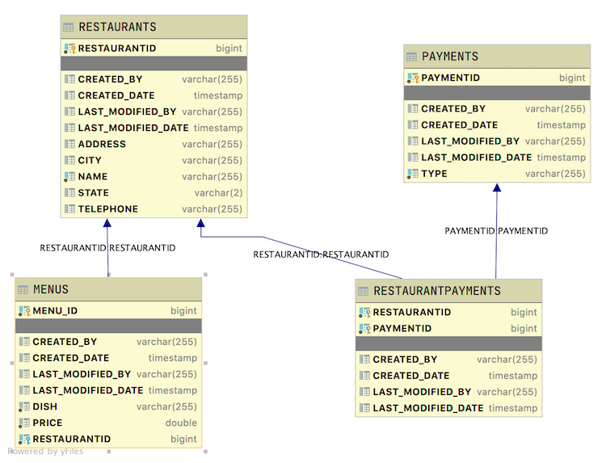

# Java Restaurants Initial Version

The is the initial version for the automated testing project.

## Introduction

This is a database scheme with restaurants, menus, payment system. This Java Spring REST API application will provide endpoints for clients to read various data sets contained in the application's data.

Using the provided seed data, a successful application will return the following data based on the given endpoint. Expand the section of the endpoint to see the data that is returned.

### Database Layout

The table layouts are as follows

* Restaurant is the driving table.
* Menus have a Many-To-One relationship with Restaurant. Each Restaurant has many menus. Each menu has only one Restaurant.
* Payments have a Many-To-Many relationship with Restaurants.



Using the provided seed data, the given endpoint will produce the stated output. Expand each endpoint to see its correct output.

<details>
<summary>http://localhost:2019/restaurants/restaurants</summary>

```JSON
```

</details>

<details>
<summary>http://localhost:2019/restaurants</summary>

```JSON
```

</details>

<details>
<summary>http://localhost:2019/restaurants</summary>

```JSON
```

</details>

<details>
<summary>http://localhost:2019/restaurants</summary>

```JSON
```

</details>

<details>
<summary>http://localhost:2019/restaurants</summary>

```JSON
```

</details>
